<!-- _class: lead -->

# Bad AI In A Box (**BAIIAB**)

*Making AI "Touch Grass"*
Tommy Falgout

<!--
Talk about Ignite
Showcasing passion projects
Partnership with Ignite
-->

---

<!-- _class: lead -->

# Bad AI In A Box (**BAIIAB**)

*Making AI "Touch Grass"*
Tommy Falgout

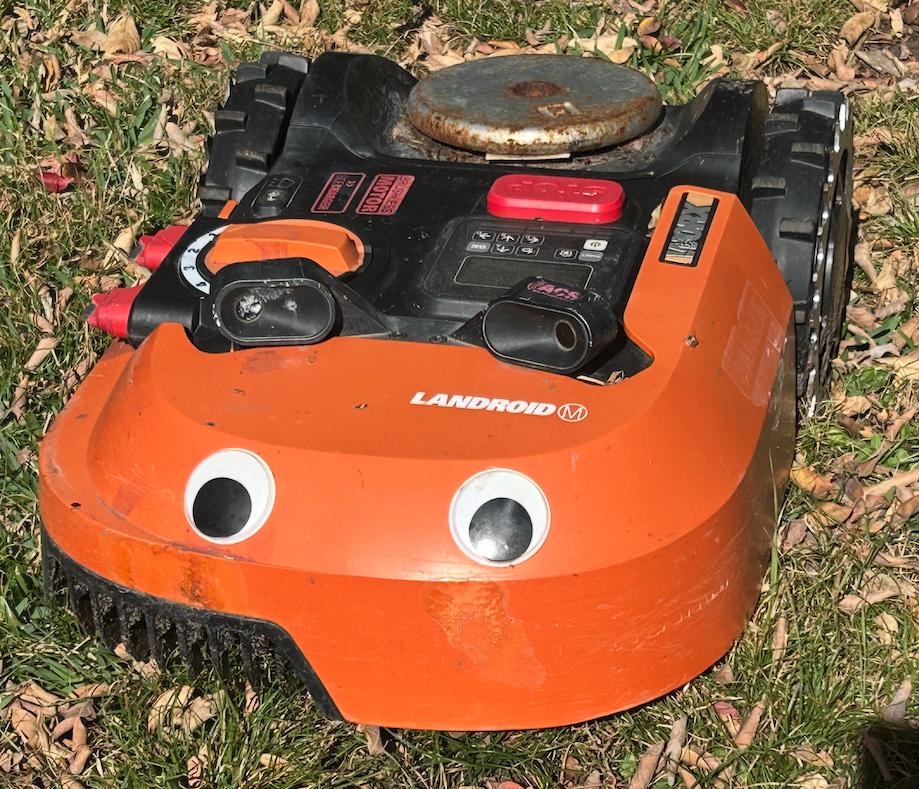

<!--
Talk about Ignite
Showcasing passion projects
Partnership with Ignite
-->

---

# Me

- Big maker nerd
  - [LEGO Robo-Clippy](https://github.com/lastcoolnameleft/robo-clippy)
  - [Bad AI In A Box](https://github.com/lastcoolnameleft/baiiab)
  - [LED Lanyard](https://ledlanyard.com)
  - [NTX Makers](https://www.ntxmakers.com/)
- Partner Solution Architect @ Microsoft (ex-Yahoo!, ex-Nortel)
- [Trebuchet expert for Dude Perfect](https://www.imdb.com/name/nm9305352/) (S2.E6)


<!--
_footer: Source: me
-->

---

# WHY?!?!

**Make AI Intriguing and Silly, Not Scary**

- Inspired by friends "[Fortune Witch](https://www.olisny.com/fortune-witch/)" 
- Build upon [Adafruit project](https://learn.adafruit.com/pi-thermal-printer)
- Wanted to create something **tangible** and **fun**
- AI can feel intimidating and complex
- Physical interaction makes more approachable

> *"What if interfacing with AI could be as simple as turning a knob?"*

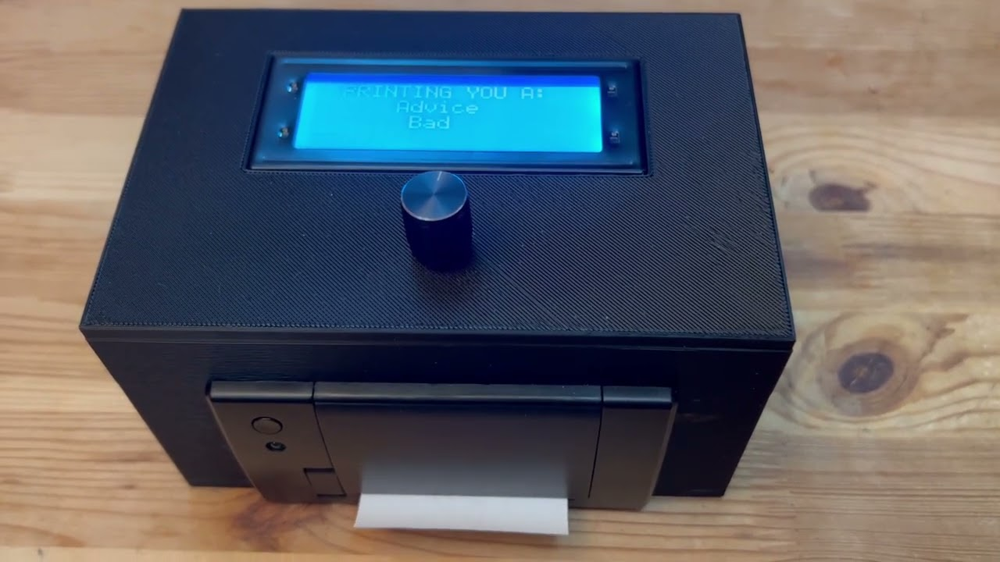

---

# Project Evolution

Started as a learning exercise...

1. **Initial Goal**: Learn this newfangled ChatGPT thingy
2. **First Iteration**: [Bad Advice As A Service (BaaaS)](https://advice.lastcoolnameleft.com/)
3. **Physical Interface**: Added Raspberry Pi + LCD + Dial
4. **Offline Mode**: If WiFi / Tethering fails
5. **Observability**: Added OpenTelemetry
6. **Cloud Integration**: Connected to Elastic's Observability Platform

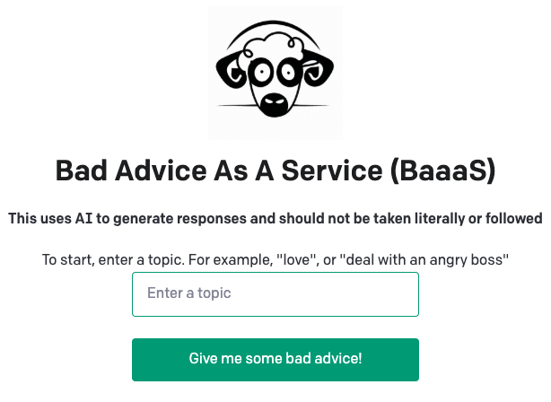

---

# The Big Moment

### Microsoft Build 2025 - Day 3 Keynote

**Co-presented with:**
- **Mark Russinovich** - Azure CTO
- **Scott Hanselman** - Developer Advocate Legend

[Demonstrated live on stage](https://youtu.be/KIFDVOXMNDc?t=3233):
- 1000+ live audience
- 10k YouTube views

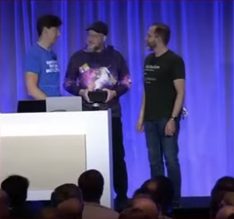

---

# Technical Architecture 
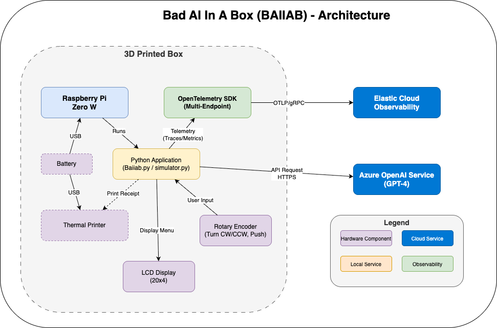

---

# Bill of Materials (BOM) 

## Hardware Components

| Component | Purpose |
|-----------|---------|
| **Raspberry Pi Zero 2 W** | 4 core, Debian based |
| **20x4 LCD Display** | Show navigation menus |
| **Rotary Encoder** | Navigation (turn + push) |
| **Thermal Printer** | Receipt paper output |
| **Enclosure** | Custom 3D printed case |

**Total Cost**: ~$150-$200


---

# User Experience Flow

```
                                                ┌─────────────────────┐
                                                │   WELCOME SCREEN    │ 4x20 LCD screen
                                                │   AI In A Box       │
                                                └─────────────────────┘
                                                        ↓ (turn to browse)
                                                ┌─────────────────────┐
                                                │   > Joke            │
                                                │     Advice          │
                                                │     Recipe          │
                                                │     Insult          │
                                                └─────────────────────┘
                                                        ↓ (push to select)
                                                ┌─────────────────────┐
                                                │   > Dad Joke        │
                                                │     Funny           │
                                                │     Absurd          │
                                                └─────────────────────┘
                                                        ↓ (push to generate)
                                                ┌─────────────────────┐
                                                │   GENERATING...     │
                                                │   Azure OpenAI GPT-4│
                                                └─────────────────────┘
                                                        ↓ (print)
                                                ┌─────────────────────┐
                                                │       [Logo]        │ 
                                                │      [BAIIAB]       │
                                                │                     │ Receipt Paper
                                                │    [AI Response]    │
                                                │    [Disclaimer]     │
                                                │   [bit.ly/baiiab]   │
                                                └─────────────────────┘
```

---

# The Box


- Designed in OpenSCAD + Tinkercad
- Inspired by "The Internet"
- 3D Printed (PLA)
- Holes for thermal printer, knobs, display

---

# OpenSCAD

- 3D Modeler for programmers
- Enables parametric design
- Customize knob

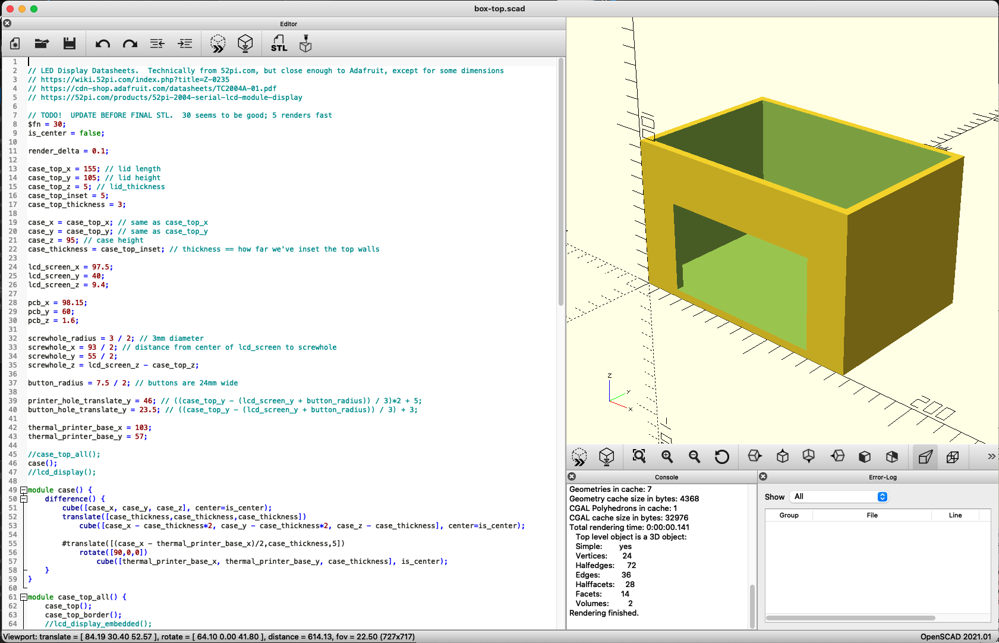

---

# The Interface

Inspired by my Prusa i3 MK3 printer interface

- Uses a 20x4 character LCD display
- Re-wrote interface in Python


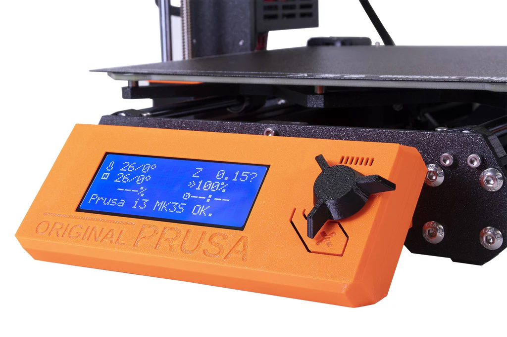

---

# Rotary Encoder

1. **Turn Clockwise** ↻
   - Navigate down through menu options
   
2. **Turn Counter-Clockwise** ↺
   - Navigate up through menu options
   
3. **Push Button** 🔘
   - Select current option
   - Generate AI response

**Callbacks handled in Python**

**That's it!** No keyboard, no mouse, no touch screen.

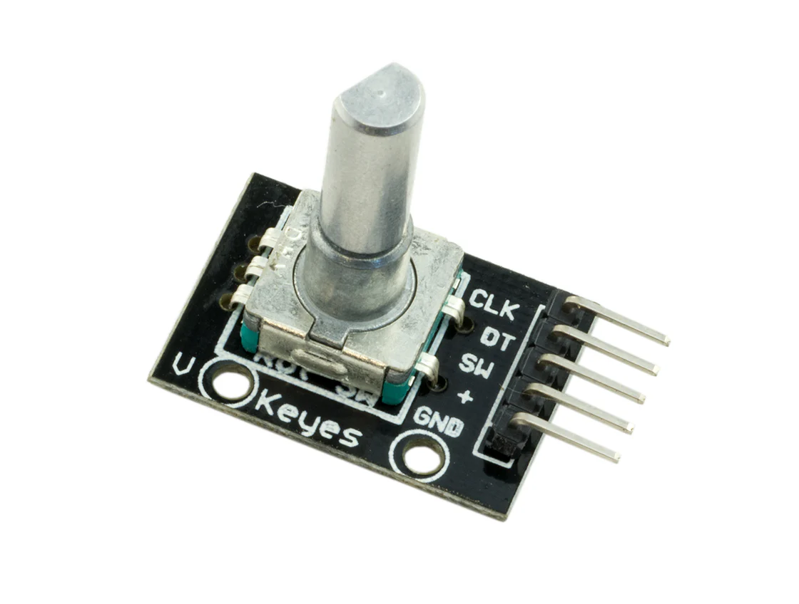

---

# Thermal Printer

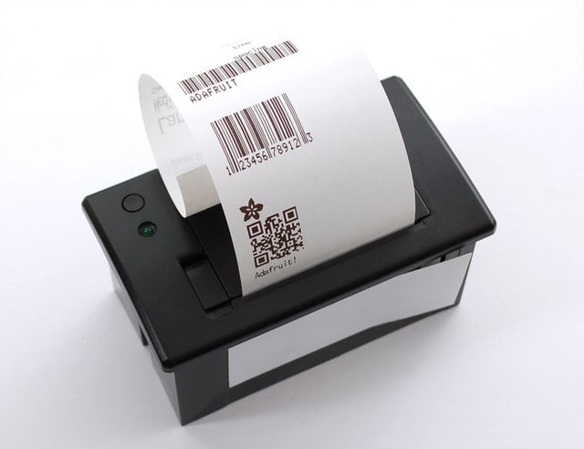

- Originaly from [Adafruit](https://www.adafruit.com/product/597)
        - [Python Library](https://github.com/adafruit/Adafruit-Thermal-Printer-Library)
        - Discontinued!
- Character Set: ASCII
- Protocol: TTL Serial, 19200 baud
---

# Battery Capacity

- mAh = how long a device can run
- Think of mAh as the size of a fuel tank:
  - A 2000 mAh battery can power a 100 mA device for 20 hours
  - Higher mAh = longer runtime
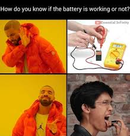

---

# How do you measure this?!


- [USB multimeters](https://amzn.to/45PBLf5) are your friend!
- Project requires 2 USB connections
  - RPi + Thermal Printer


---


# Content Categories 

Stored in config file: **Topic -> Subtopic -> Prompt**

- Advice - Bad, Silly, Cryptic, Good
- Fake Facts - Darth Vader, Satya Nadella
- Cocktail - Tasty, Disgusting
- Conspiracy - Funny, Crazy, Dark
- Insult - Monty Python, Shakespeare, French, German, Spanish

*All powered by Azure OpenAI (GPT-4)*


---

# Architecture Decisions 

## Why These Choices?

| Decision | Reason |
|----------|--------|
| **Raspberry Pi** | Affordable, powerful, GPIO support, __low power__ (0.17A)|
| **Python** | Fast prototyping, rich libraries |
| **20x4 LCD** | Perfect size, cheap, reliable |
| **3D Print** | Reproducable, custom design |
| **Rotary Encoder** | Intuitive, tactile feedback |
| **OpenTelemetry** | Vendor-neutral, future-proof |
| **Azure OpenAI** | GPT-4 access, company perk |

---

# The Numbers

## Project Stats

- **Lines of Code**: ~2,500
- **Topics**: 5 "main" ones
- **Subtopics**: 2-5+ each topic
- **Cost per request**: ~$0.02 (GPT-4)
- **Response time**: 1-3 seconds average
- **Conference demos**: 100+ interactions

---

# Adding Observability

## OpenTelemetry Integration

**Why?** To understand:
- How users interact with the device
- API performance
- Error rates and patterns
- Most popular requests
- How much this is costing Microsoft...

**Connected to Elastic's Observability Platform**
- Real-time traces
- Metrics and dashboards


---

# Elastic Observability Integration

## Why Elastic?

**Unified Platform:**
- Logs, metrics, traces in one place
- APM for application performance
- Custom dashboards and alerts

**OTLP Support:**
- Native OpenTelemetry ingestion
- Easy migration

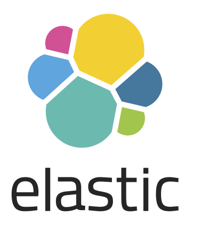

---

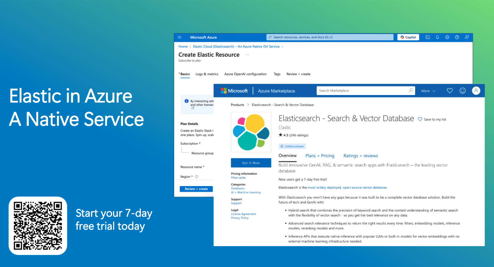

---


---

# Metrics Tracked

- **API Calls**: Count, duration, model, status
- **User Interactions**: Category selections, navigation
- **Response Times**: API Call duration
- **Error Rates**: Failed calls, timeouts
- **Popular Content**: Most requested categories

*All visualized in Elastic dashboards*

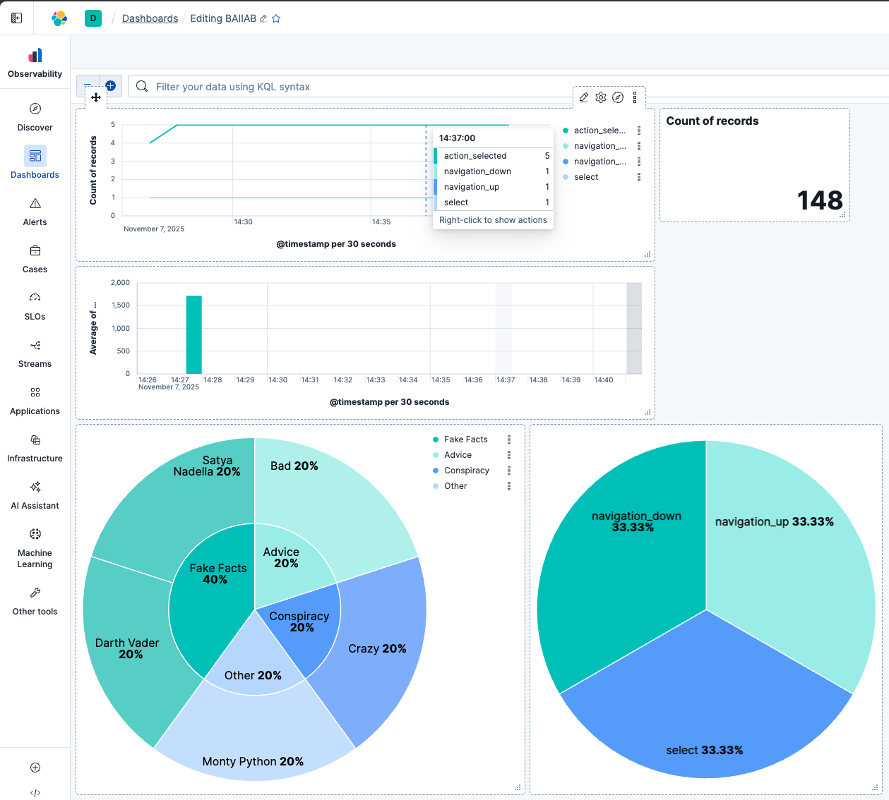


---

# Beyond the Novelty

**Physical AI interfaces:**
- Bridge digital-physical divide
- Make AI accessible to non-technical users
- Create memorable experiences

**Observability:**
- Understand user behavior
- Debug production issues

**Open Source:**
- Share learning pains
- "With enough eyes, all bugs are shallow..."


---

# Challenges Overcome 

**Hardware:**
- Make it fit → custom cables, box
- Periphals → Lots of failing in prod
- Encoder debouncing → added sleep(?)

**Software:**
- API timeout handling → retry logic + offline mode
- RPi + gRPC = PAIN → Migrate to HTTP (no compilation)
- Menu navigation logic → state machine pattern

---

## Offline Mode 

### Resilience Built-In

**Fallback responses** when network fails:
- Pre-generated responses 
- Stored in JSON

**Benefits:**
- Works at conferences (spotty WiFi)
- Demo reliability

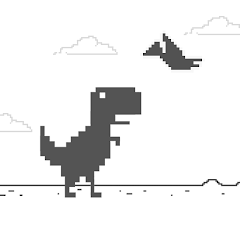

---

# What's Next?

- User Feedback (Thumbs up/down)
- ~~Audio~~ - Not good for conferences
- ~~Local LLM~~ - 1 Core CPU
- Mobile?  IoT?  Camera?
- Print out cost?
- Fix issues with some Unicode (e.g. "¾ oz Bourbon")

---

## Ignite 2025

- [Register here](https://ignite.microsoft.com/en-US/home) - Free online pass

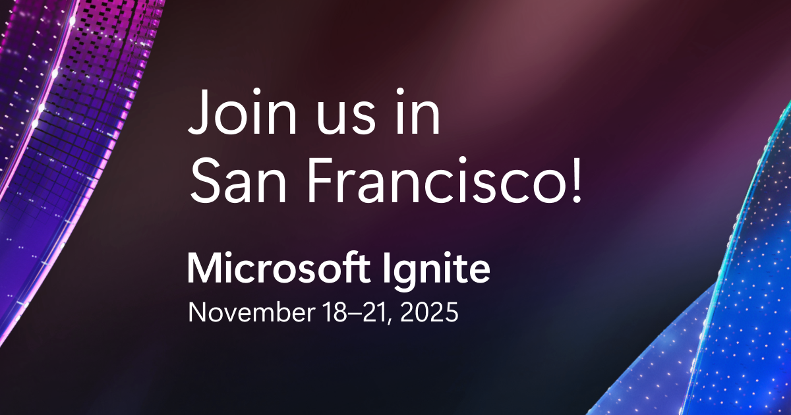

---


# FAQ

**Q: Why Raspberry Pi?**
A: Affordable, powerful, great GPIO support, huge community

**Q: Can I use different AI models?**
A: Yes! Works with any OpenAI-compatible API

**Q: Can it work offline?**
A: Yes! Fallback mode with pre-generated content

**Q: Why OpenTelemetry?**
A: Vendor-neutral, future-proof, rich ecosystem

**Q: Can I add custom categories?**
A: Absolutely! Edit conf/menu.json

---

# Key Takeaways

## What Makes This Special

1. ✨ **Tangible AI** - physical beats digital for engagement
1. 🎮 **Simple Interface** - 3 interactions = maximum accessibility
1. � **Observable** - understand usage
1. �🔌 **Resilient** - works online and offline
1. 🌐 **Open Source** - learn, share, improve
1. 💰 **Affordable** - ~$150-200 in parts

---

# Resources

## Learn More

**Code & Documentation:**
- GitHub: [github.com/lastcoolnameleft/baiiab](https://github.com/lastcoolnameleft/baiiab)
- Issues & PRs welcome!

**Technologies:**
- OpenTelemetry: [opentelemetry.io](https://opentelemetry.io)
- Elastic Observability: [elastic.co/observability](https://elastic.co/observability)
- Azure OpenAI: [azure.microsoft.com/openai](https://azure.microsoft.com/openai)
- Raspberry Pi: [raspberrypi.org](https://raspberrypi.org)


---

<!-- _class: lead -->

# **BAIIAB - Bad AI In A Box**

# Slides available at: [https://lastcoolnameleft.github.io/baiiab/](https://lastcoolnameleft.github.io/baiiab/)


<!--
_footer:  Slides writen in [MARP](https://marp.app/)

-->
---

*Built with ❤️ and penTelemetry*

GitHub: lastcoolnameleft/baiiab
Website: lastcoolnameleft.com
Email: tommy lastcoolnameleft com

